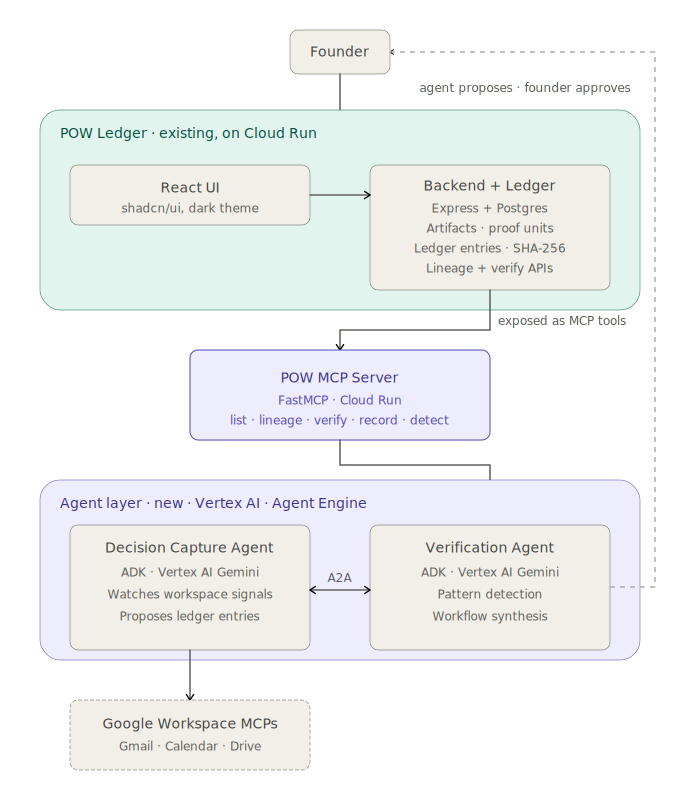

# POW Ledger Verification System

A multi-agent AI system that captures organizational decisions as cryptographically sealed artifacts and verifies their integrity through an immutable ledger.

Built with Google ADK, Gemini 2.5 Flash, and Vertex AI Agent Engine for the Google for Startups AI Agents Challenge 2026 (Track 1).

---

## What it does

Organizations make thousands of decisions — architecture choices, policy changes, strategic pivots — but rarely have a system of record for *why* those decisions were made, *who* made them, or *whether* the record has been tampered with. POW Ledger solves this.

A user describes a decision in natural language. The system captures it as a cryptographically hashed artifact, links events to it over time, and later verifies that no entry in the decision's lineage has been altered. Three specialized agents collaborate through a single orchestrator, enforcing a strict single-writer protocol: only one agent can mutate the ledger, while another independently verifies integrity.

**Example flow:**

```
User: "Capture this decision: We are standardizing on PCOMJR architecture
       across all TalonSight terminals for consistent artifact provenance tracking"

System: Decision captured.
        Artifact ID: art_7f3a...
        SHA-256 hash: e4b2c9...
        Event recorded with signature verification.

User: "Verify artifact art_7f3a..."

System: Entry 1 — Valid ✅ (hash recomputed, matches stored)
        Entry 2 — Valid ✅ (event signature verified)
        No automatable workflow patterns detected (< 3 similar decisions).
```

---

## Architecture

```
User → Orchestrator Agent (router, no direct ledger access)
         ├── capture_decision → Capture Agent (single-writer)
         │      └── append_decision + record_event → MCP Server → Ledger API → Cloud SQL
         └── verify_artifact → Verification Agent (reader)
                └── get_lineage + verify_entry + propose_workflow → MCP Server → Ledger API
```



*For the full interactive architecture diagram, open `architecture_diagram.html` in a browser.*

Three agents deployed on **Vertex AI Agent Engine**, communicating via **Agent-to-Agent (A2A)** protocol using `stream_query`. Each agent runs **Gemini 2.5 Flash** with specialized instructions and tool access.

An **MCP Server** on Cloud Run implements the **Streamable HTTP** protocol, exposing 5 tools. The server mints a fresh Google ID token per request, solving the 1-hour token expiry problem inherent to long-running agent sessions.

A **Ledger API** on Cloud Run handles decision persistence, SHA-256 hash computation, and integrity verification against a **Cloud SQL (PostgreSQL)** database.

### Key design decisions

**Single-writer protocol.** Only the Capture Agent can mutate the ledger (`append_decision`, `record_event`). The Verification Agent has read-only access (`get_lineage`, `verify_entry`, `propose_workflow`). The Orchestrator has no direct ledger access at all — it routes via A2A. This separation prevents write conflicts and makes the integrity model auditable.

**MCP over direct function calls.** Rather than giving each agent direct database access, all ledger operations go through an MCP Server implementing the Streamable HTTP protocol. This provides a clean tool interface, centralizes authentication, and makes the system extensible.

**Fresh ID tokens per request.** ADK's built-in `McpToolset` crashes on Agent Engine with a `TaskGroup` error due to async event loop conflicts. We replaced it with direct HTTP wrapper functions that implement the MCP Streamable HTTP protocol manually, minting a fresh Google ID token for each call. This also fixes the 1-hour token expiry issue.

**Anti-code-generation instructions.** Gemini 2.5 Flash occasionally generates Python code instead of calling tools when sub-agents are invoked directly. Adding explicit instructions ("NEVER generate Python code, NEVER use `print()`") to each agent's system prompt eliminates this.

---

## Technology stack

| Component | Technology | Purpose |
|---|---|---|
| Agent framework | Google ADK (Python) | Agent definition, tool binding, A2A routing |
| Model | Gemini 2.5 Flash | Reasoning for all three agents |
| Agent hosting | Vertex AI Agent Engine | Production deployment, session management |
| MCP Server | FastMCP + Cloud Run | Streamable HTTP tool server (5 tools) |
| Ledger API | Express + Cloud Run | Decision storage, SHA-256 hashing |
| Database | Cloud SQL (PostgreSQL) | Persistent ledger store |
| Frontend | React, Vite, shadcn/ui, Tailwind | Ledger dashboard and artifact browser |
| Eval | Python (custom harness) | 6 automated test scenarios |

**GCP Project:** `proof-of-work-497822` · **Region:** `us-central1`

---

## Agent inventory

### Orchestrator Agent
- **Role:** Router. Receives user prompts, classifies intent, routes to the appropriate sub-agent via A2A.
- **Tools:** `capture_decision` (calls Capture Agent), `verify_artifact` (calls Verification Agent)
- **Ledger access:** None.

### Capture Agent
- **Role:** Single-writer. The only agent authorized to mutate the ledger.
- **Tools:** `append_decision` (creates artifact with SHA-256 hash), `record_event` (links event with signature), `list_artifacts` (reads artifact index)
- **MCP calls:** Direct HTTP to MCP Server with per-request ID token auth

### Verification Agent
- **Role:** Reader. Independently verifies ledger integrity without write access.
- **Tools:** `get_lineage` (retrieves full entry chain), `verify_entry` (recomputes SHA-256 hash), `propose_workflow` (pattern detection across 3+ similar decisions)
- **MCP calls:** Direct HTTP to MCP Server with per-request ID token auth

---

## MCP tool reference

| Tool | Agent | Direction | Description |
|---|---|---|---|
| `append_decision` | Capture | Write | Create a new decision artifact with SHA-256 hash |
| `record_event` | Capture | Write | Link an event to an existing artifact with signature |
| `list_artifacts` | Capture | Read | List all artifacts in the ledger |
| `get_lineage` | Verification | Read | Get full entry chain for a given artifact ID |
| `verify_entry` | Verification | Read | Recompute SHA-256 and compare against stored hash |
| `propose_workflow` | Verification | Read | Detect repeated patterns across similar decisions |

---

## Running locally

### Prerequisites
- Python 3.11+, Node.js 18+, Google Cloud CLI
- `gcloud auth application-default login`

### Start the frontend
```bash
npm install && npm run dev
# → http://localhost:3000
```

### Run the eval harness
```bash
source agents/verification/.venv/bin/activate
python eval_harness.py
# → 6/6 passed, ~54s → eval_report.json
```

### Test the Orchestrator
```bash
ORCH=$(cat agents/orchestrator/deployed_resource.txt)

# Capture a decision
python -c "
import vertexai
from vertexai import agent_engines
vertexai.init(project='proof-of-work-497822', location='us-central1')
orch = agent_engines.get('$ORCH')
session = orch.create_session(user_id='demo-user')
for event in orch.stream_query(user_id='demo-user', session_id=session['id'],
    message='Capture this decision: We are standardizing on PCOMJR architecture across all TalonSight terminals'):
    content = event.get('content', {})
    for part in content.get('parts', []):
        if 'text' in part: print(part['text'])
"

# Verify an artifact (replace ARTIFACT_ID)
python -c "
import vertexai
from vertexai import agent_engines
vertexai.init(project='proof-of-work-497822', location='us-central1')
orch = agent_engines.get('$ORCH')
session = orch.create_session(user_id='demo-user')
for event in orch.stream_query(user_id='demo-user', session_id=session['id'],
    message='Verify artifact ARTIFACT_ID'):
    content = event.get('content', {})
    for part in content.get('parts', []):
        if 'text' in part: print(part['text'])
"
```

---

## Eval harness

`eval_harness.py` runs 6 automated scenarios in ~54 seconds:

| # | Scenario | Tests |
|---|---|---|
| 1 | Round-trip E2E | Capture a decision, verify the resulting artifact |
| 2 | Routing: capture | Orchestrator routes decision capture correctly |
| 3 | Routing: verify | Orchestrator routes verification correctly |
| 4 | Non-decision rejection | System rejects casual non-decision input |
| 5 | Invalid ID handling | Graceful handling of non-existent artifact IDs |
| 6 | List artifacts | Capture Agent's `list_artifacts` returns data |

Results saved to `eval_report.json`.

---

## Repository structure

```
Proof-Of-Work/
├── agents/
│   ├── orchestrator/           # Orchestrator agent (ADK + Vertex AI)
│   │   ├── agent.py            # A2A routing via capture_decision + verify_artifact
│   │   ├── deploy.py           # Agent Engine deployment script
│   │   └── deployed_resource.txt
│   ├── capture/                # Capture agent (single-writer)
│   │   ├── agent.py            # MCP wrappers: append_decision, record_event, list_artifacts
│   │   ├── deploy.py
│   │   └── deployed_resource.txt
│   └── verification/           # Verification agent (reader)
│       ├── agent.py            # MCP wrappers: get_lineage, verify_entry, propose_workflow
│       ├── pattern_detection.py
│       ├── deploy.py
│       ├── tests/
│       └── deployed_resource.txt
├── mcp-server/                 # FastMCP server (Streamable HTTP, Cloud Run)
│   ├── server.py
│   ├── Dockerfile
│   └── requirements.txt
├── server/                     # Ledger API backend (Express, Cloud Run)
│   ├── routes.ts               # REST endpoints for ledger operations
│   ├── storage.ts              # Cloud SQL persistence
│   └── db.ts
├── client/                     # React frontend (Vite + shadcn/ui)
│   └── src/
│       ├── components/
│       │   ├── ledger-dashboard.tsx
│       │   ├── artifact-list.tsx
│       │   ├── artifact-editor.tsx
│       │   └── snapshot-view.tsx
│       └── pages/
├── shared/                     # Drizzle schema
│   └── schema.ts
├── docs/
│   ├── architecture.svg
│   ├── business-case.md
│   ├── demo-script.md
│   └── SUBMISSION.md
├── eval_harness.py             # 6-scenario automated eval
├── eval_report.json            # Latest results (6/6 pass)
├── architecture_diagram.html   # Interactive architecture diagram
└── package.json
```

---

## Deployment

```
Orchestrator   → projects/878967828995/locations/us-central1/reasoningEngines/1392182381636485120
Capture        → projects/878967828995/locations/us-central1/reasoningEngines/3575852056818221056
Verification   → projects/878967828995/locations/us-central1/reasoningEngines/5023772531157368832
MCP Server     → pow-mcp-server-878967828995.us-central1.run.app/mcp
Ledger API     → pow-ledger-878967828995.us-central1.run.app
```

---

## Findings and learnings

**What worked:** The single-writer protocol eliminates race conditions and makes integrity verification meaningful. Vertex AI Agent Engine provides production-grade session management out of the box. Streamable HTTP for MCP is more reliable than SSE on Cloud Run.

**What we learned the hard way:** ADK's `McpToolset` crashes on Agent Engine (TaskGroup error) — direct HTTP wrappers are the fix. ID tokens expire silently after 1 hour — mint fresh per request. Gemini generates code instead of calling tools when sub-agents are invoked directly — anti-code-generation instructions fix this. Import-time `agent_engines.get()` calls cause fatal startup failures — lazy accessors solve it.

**What we'd do differently:** Build MCP tool schemas before agent development. Add structured Cloud Logging to MCP invocations. Implement a dead-letter queue for failed writes.

---

## Business case

See [`docs/business-case.md`](docs/business-case.md) for the full analysis.

POW Ledger addresses a gap in organizational decision management. Decisions are scattered across Slack, email, meeting notes, and undocumented memory. When questions arise — "Why did we choose this vendor?", "Who approved this change?" — there's no system of record. POW Ledger provides cryptographic integrity verification for organizational decisions, targeting engineering teams and compliance-sensitive organizations. Unlike document tools (Notion, Confluence), it proves records haven't been altered. Unlike blockchain solutions, it runs on standard cloud infrastructure with sub-second latency.

---

## License

MIT

---

*Built by Jermaine Nelson ([TalonSight Technologies](https://talonsight.tech)) for the Google for Startups AI Agents Challenge 2026.*
